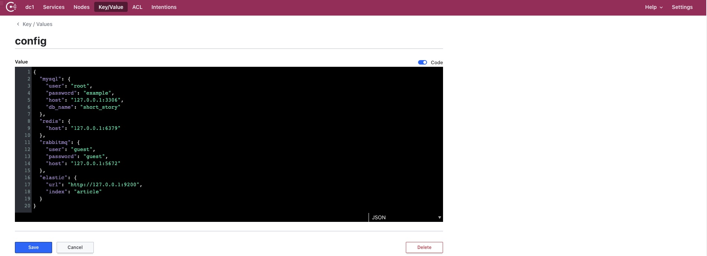
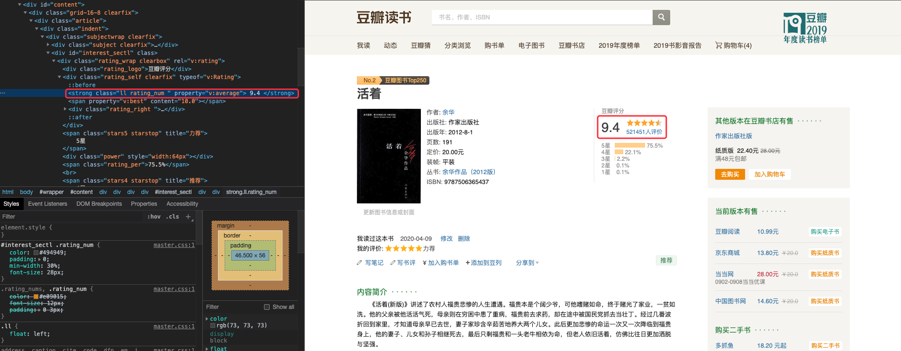
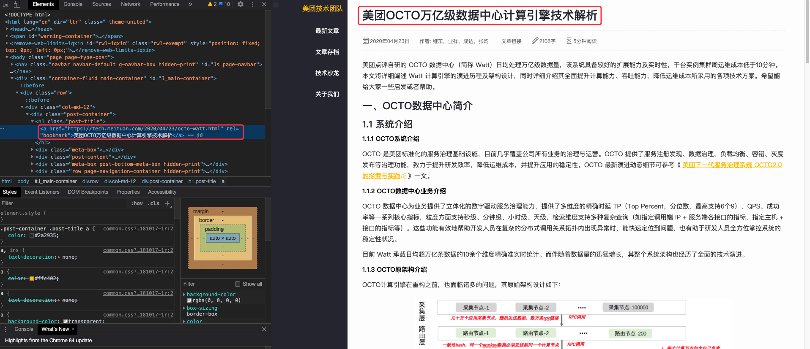
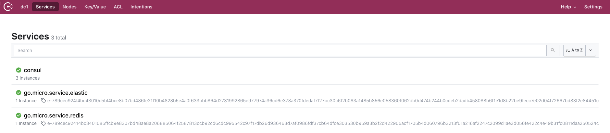
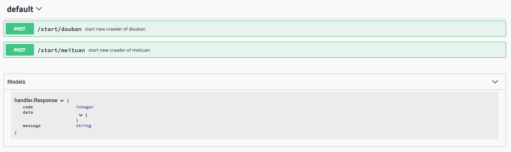
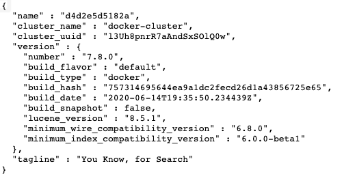
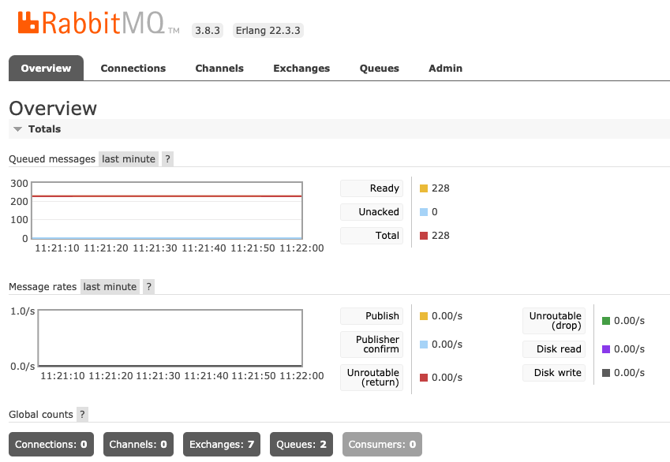
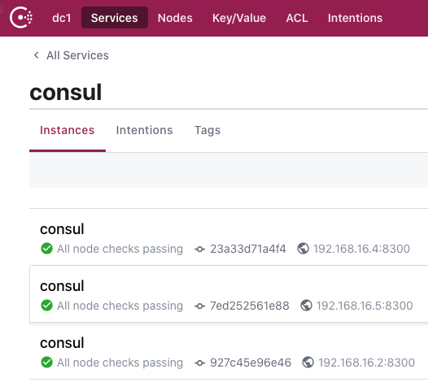

# go-crawler-distributed
<div align="center">


<a href="https://github.com/SuperSupeng">      </a> 
<a href="https://github.com/golang-collection/go-crawler-distributed/issues">      </a>
<a href="https://github.com/golang-collection/go-crawler-distributed/network/members">      </a>
<a href="https://github.com/golang-collection/go-crawler-distributed/stargazers">      </a>
<a href="https://github.com/golang-collection/go-crawler-distributed/blob/master/LICENSE">      </a>
<a href="https://github.com/golang-collection/Urban-computing-papers/blob/master/wechat.md">      </a>
</div>

---

Github：[https://github.com/golang-collection/go-crawler-distributed](https://github.com/golang-collection/go-crawler-distributed)

Distributed crawler projects, the project supports personalization page parser secondary development, the whole project using micro service architecture, messages are sent asynchronously through message queues, Use the following framework: redigo, gorm, goquery, easyjson, viper, closer, zap, go-micro, and containable deployment is realized through Docker, intermediate crawler nodes support horizontal expansion.

分布式爬虫项目，本项目支持个性化定制页面解析器二次开发，项目整体采用微服务架构，通过消息队列实现消息的异步发送，使用到的框架包括：redigo, gorm, goquery, easyjson, viper, amqp, zap, go-micro，并通过Docker实现容器化部署，中间爬虫节点支持水平拓展。

# 目录结构
```go
- cache redis相关操作
- config 存放配置文件
- crawler 处理爬虫相关逻辑
    - crawerConfig 爬虫对应的消息队列配置
    - douban 豆瓣网页解析
    - fetcher 网页抓取
    - meituan 美团网页解析
    - persistence 定义用于保存数据的结构体
    - worker 具体的工作逻辑，通过它实现代码的解耦
    - crawlOperation 除存储外统一爬虫处理模块
- db mysql操作
- dependencies 项目依赖的环境相关的docker-compose文件
- deploy 脚本
    - buildScript 部署脚本
    - deploy 直接启动项目的脚本
    - dockerBuildScript 构建docker镜像
    - service 用于存放服务的Dockerfile
- docs swagger文档
- elastic elastic的相关操作
- handler 构建RestfulAPI
- model 结构体定义
- mq 消息队列操作
- pkg 通用包
- router 构建路由
- runtime 日志文件
- service 微服务
    - cache redis微服务通过grpc操作
      - proto 定义grpc的proto文件
      - server 定义grpc的服务端
    - douban 豆瓣相关服务
      - crawl_tags 用于爬取豆瓣的[tags](https://book.douban.com/tag/)，此页面为爬虫的起始界面
      - crawl_list 用于爬取豆瓣的[list](https://book.douban.com/tag/%E5%B0%8F%E8%AF%B4)
      - crawl_detail 用于爬取豆瓣的图书具体内容[detail](https://book.douban.com/subject/25955474/)
      - storage_detail 用于存储豆瓣的图书具体内容，存储到MySQL中
    - elastic elasticSearch微服务通过grpc操作
      - proto 定义grpc的proto文件
      - server 定义grpc的服务端
    - meituan 美团相关服务
      - crawl_tags 用于爬取美团的[list](https://tech.meituan.com/)，此页面为爬虫的起始界面
      - crawl_list 用于爬取美团的[urllist](https://tech.meituan.com/page/2.html)
      - crawl_detail 用于爬取美团技术文章的页面具体内容[detail](https://tech.meituan.com/2020/04/23/octo-watt.html)
      - storage_detail 用于存储美团技术文章的具体内容，存储到ElasticSearch中
    - watchConfig 配置相关
- tools 小工具
- unifiedLog 统一日志操作
- main.go 项目统一入口
```

# 配置文件
You need to customize your configuration. Create the config.json file under the config folder in the project root directory or add a config in Consul.

The sample of config.json.
```json
{
  "mysql": {
    "user": "root",
    "password": "example",
    "host": "127.0.0.1:3306",
    "db_name": "short_story"
  },
  "redis": {
    "host": "127.0.0.1:6379"
  },
  "rabbitmq": {
    "user": "guest",
    "password": "guest",
    "host": "127.0.0.1:5672"
  },
  "elastic": {
    "url": "http://127.0.0.1:9200",
    "index": "article"
  }
}
```

Viper reads the remote configuration file.



```go
func init() {
	err := viper.AddRemoteProvider("consul", config.ConsulURL, config.ConsulConfigPath)
	if err != nil {
		logger.Error("read config",zap.Error(err))
		return
	}
	viper.SetConfigType("json") // Need to explicitly set this to json
	if err := viper.ReadRemoteConfig(); err != nil {
		logger.Error("read config",zap.Error(err))
		return
	}
}
```

More detail: [watchConfig](./service/watchConfig)

# Parser

## [douban](./crawer/douban)

Parser：[parser](./crawler/douban/parser) uses css selectors for page parsing.



## [meituan](./crawer/meituan)
Parser: [parser](./crawler/meituan/parser) uses css selectors for page parsing.



# Framework


Register the micro service in Consul.



# Architecture


# Installation

Deploying projects locally or in the cloud provides two ways:

- Direct Deploy
- Docker(Recommended)

# Pre-requisite

- Go 1.13.6
- Redis 6.0
- MySQL 5.7
- RabbitMQ management
- ElasticSearch
- Consul
- Others [go.mod](./go.mod)


# Quick Start

Please open the command line prompt and execute the command below. Make sure you have installed `docker-compose` in advance.

```bash
git clone https://github.com/Knowledge-Precipitation-Tribe/go-crawler-distributed
cd go-crawler-distributed/deploy/buildScript
bash linux_build
cd ../
docker network create -d bridge crawler
docker-compose up -d
```

The above command has started the basic services, including Consul, Redis, elasticSearch, RabbitMQ, and mysql. RPC services for Redis and elasticSearch are also included.

```bash
docker-compose up -d
```

```go
[GIN-debug] GET    /swagger/*any             --> github.com/swaggo/gin-swagger.CustomWrapHandler.func1 (7 handlers)
[GIN-debug] GET    /sd/health                --> go-crawler-distributed/handler/sd.HealthCheck (7 handlers)
[GIN-debug] GET    /sd/disk                  --> go-crawler-distributed/handler/sd.DiskCheck (7 handlers)
[GIN-debug] GET    /sd/cpu                   --> go-crawler-distributed/handler/sd.CPUCheck (7 handlers)
[GIN-debug] GET    /sd/ram                   --> go-crawler-distributed/handler/sd.RAMCheck (7 handlers)
[GIN-debug] POST   /crawler/douban           --> go-crawler-distributed/handler/crawler.StartDoubanCrawler (7 handlers)
[GIN-debug] POST   /crawler/meituan          --> go-crawler-distributed/handler/crawler.StartMeituanCrawler (7 handlers)
{"level":"info","time":"2020-09-04T11:29:14.954+0800","linenum":"go-crawler-distributed/main.go:59","msg":"Start to listening the incoming requests on http address:80"}
{"level":"info","time":"2020-09-04T11:29:14.956+0800","linenum":"go-crawler-distributed/main.go:55","msg":"The router has been deployed successfully."}
```

swagger ui:




# Port

- 6379: redis
- 3306: mysql
- 9200, 9300: elasticSearch



- 5672, 15672: rabbitMQ



- 8500: consul



# Run

## Basic services

Please use `docker-compose` to one-click to start up. Create a file named `docker-compose.yml` and input the code below.

```yaml
version: "3"

services:

  cache:
    build:
      context: cache
      dockerfile: Dockerfile
    networks:
      - crawler

  elastic:
    build:
      context: elastic
      dockerfile: Dockerfile
    depends_on:
      - elastic_server
    networks:
      - crawler

  redis:
    image: redis
    restart: always
    ports:
      - "6379:6379"
    volumes:
      - redis-data:/data
    networks:
      - crawler

  mysql:
    image: mysql
    command: --default-authentication-plugin=mysql_native_password
    restart: always
    environment:
      MYSQL_ROOT_PASSWORD: example
    networks:
      - crawler

  elastic_server:
    image: docker.elastic.co/elasticsearch/elasticsearch:7.8.0
    ports:
      - "9200:9200"
      - "9300:9300"
    volumes:
       - elastic-data:/data
    environment:
      - discovery.type=single-node
    networks:
      - crawler

  rabbitmq:
    image: rabbitmq:management
    hostname: myrabbitmq
    ports:
      - "5672:5672"
      - "15672:15672"
    volumes:
      - rabbitmq-data:/var/lib/rabbitmq
    networks:
      - crawler

  consul1:
    image: consul
    restart: always
    ports:
      - "8500:8500"
      - "8300:8300"
      - "8301:8301"
      - "8302:8302"
      - "8600:8600"
    command: agent -server -bootstrap-expect 2 -ui -bind=0.0.0.0 -client=0.0.0.0
    networks:
      - crawler

  consul2:
    image: consul
    restart: always
    ports:
      - "8501:8500"
    command: agent -server -ui -bind=0.0.0.0 -client=0.0.0.0 -join consul1
    networks:
      - crawler

  consul3:
    image: consul
    restart: always
    ports:
      - "8502:8500"
    command: agent -server -ui -bind=0.0.0.0 -client=0.0.0.0 -join consul1
    networks:
      - crawler


volumes:
  elastic-data:
  rabbitmq-data:
  redis-data:

networks:
  crawler:
    external: true
```

Then execute the command below, and the basic service will start up. 

```bash
docker-compose up -d
```

The above command has started the basic services, including Redis, elasticSearch, RabbitMQ, and mysql. RPC services for Redis and elasticSearch are also included.

## crawler service

Create a docker-composite.yml file under the meituan or douban folder.

```yaml
version: "3"

services:

  crawl_list:
    build:
      context: crawl_list
      dockerfile: Dockerfile
    networks:
      - crawler

  crawl_tags:
    build:
      context: crawl_urllist
      dockerfile: Dockerfile
    networks:
      - crawler

  crawl_detail:
    build:
      context: crawl_detail
      dockerfile: Dockerfile
    networks:
      - crawler

  storage_detail:
    build:
      context: storage_detail
      dockerfile: Dockerfile
    networks:
      - crawler

networks:
  crawler:
    external: true
```

Then execute the command below, and the crawler service will start up. 

```bash
docker-compose up -d
```

If you want to start multiple crawler nodes you can use the following command.

```bash
docker-compose up --scale crawl_list=3 -d
```

## Direct 
Start the service directly, but be aware that you need to rely on redis, RabbitMQ and other services

```bash
cd deploy/deploy/
bash start-meituan-direct.sh
```

# Appendix

- docker安装：[https://docs.docker.com/](https://docs.docker.com/)
- docker-compose安装：[https://docs.docker.com/compose/install/](https://docs.docker.com/compose/install/)

# License

[MIT](https://github.com/Knowledge-Precipitation-Tribe/DigitRecognitionService/blob/master/LICENSE)

Copyright (c) 2020 Knowledge-Precipitation-Tribe
