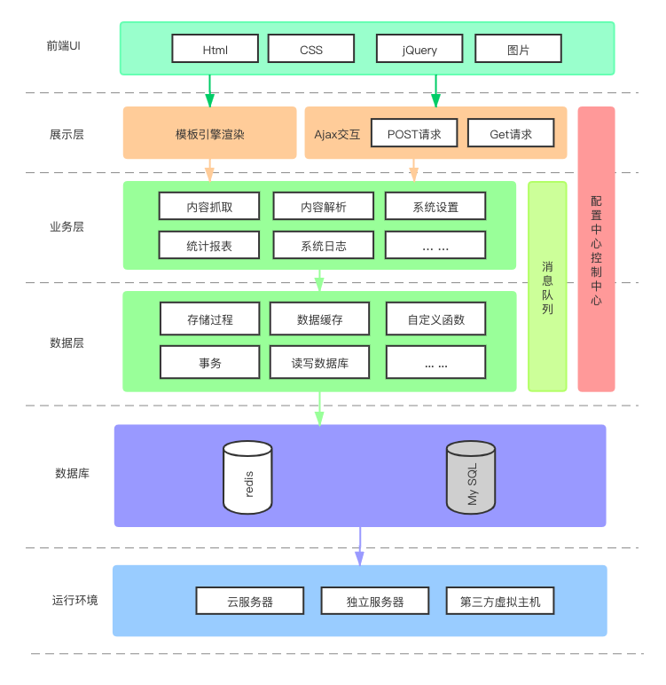
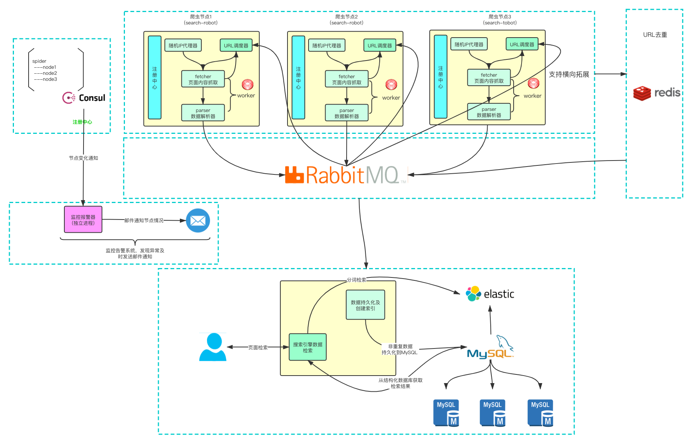

# go-crawler-distributed
<div align="center">


<a href="https://github.com/SuperSupeng">      </a> 
<a href="https://github.com/Knowledge-Precipitation-Tribe/go-crawler-distributed/issues">      </a>
<a href="https://github.com/Knowledge-Precipitation-Tribe/go-crawler-distributed/network/members">      </a>
<a href="https://github.com/Knowledge-Precipitation-Tribe/go-crawler-distributed/stargazers">      </a>
<a href="https://github.com/Knowledge-Precipitation-Tribe/go-crawler-distributed/blob/master/LICENSE">      </a>
<a href="https://github.com/Knowledge-Precipitation-Tribe/Urban-computing-papers/blob/master/wechat.md">      </a>
</div>
This project is a distributed crawler and supports the secondary development of personalized customized page parser. The overall project adopts micro-service architecture and realizes container-oriented deployment through Docker.

# Framework



# Architecture



# Installation

将项目部署到本地或云端提供以下两种方式：

- Direct Deploy
- Docker(Recommand)

### Pre-requisite (Docker)

- Docker 18.03+
- Redis 5.x+
- MySQL
- Docker Compose 1.24+
- ElasticSearch

### Pre-requisite (Direct Deploy)

- Go 1.12+
- Node 8.12+
- Redis 5.x+
- MySQL
- RabbitMQ
- ElasticSearch

## Quick Start

Please open the command line prompt and execute the command below. Make sure you have installed `docker-compose` in advance.

```
git clone https://github.com/Knowledge-Precipitation-Tribe/go-crawler-distributed
cd crawlab
docker-compose up -d
```

Next, you can look into the `docker-compose.yml` (with detailed config params).

## Run

### Docker

Please use `docker-compose` to one-click to start up. By doing so, you don't even have to configure RabbitMQ , Reds, MySQ,ElasticSearch. Create a file named `docker-compose.yml` and input the code below.

```
version: '3.3'
services:
  
```

Then execute the command below, and the project will start up. Open the browser and enter `http://localhost:8080` to see the UI interface.

```
docker-compose up
```


# Appendix

- docker安装：[https://docs.docker.com/](https://docs.docker.com/)
- docker-compose安装：[https://docs.docker.com/compose/install/](https://docs.docker.com/compose/install/)

# License

[MIT](https://github.com/Knowledge-Precipitation-Tribe/DigitRecognitionService/blob/master/LICENSE)

Copyright (c) 2020 Knowledge-Precipitation-Tribe
